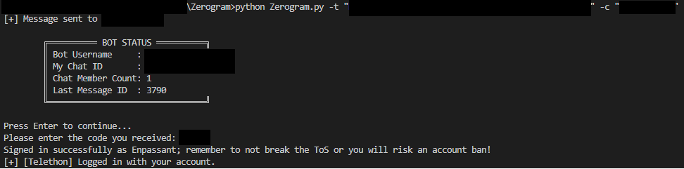

[](https://opensource.org/licenses/MIT)
[](https://www.python.org/downloads/)
[](https://github.com/Seadox/Zerogram/stargazers)
[](https://github.com/Seadox/Zerogram/network/members)

# Zerogram

**Zerogram** is a powerful Telegram bot infiltration and monitoring tool designed to forward, delete, flood, and manage messages within Telegram bots and chats. It enables security researchers to silently monitor and manipulate Telegram bot messages, automate interactions, and extract information from targeted bot chats.
**Note:** Employing this tool may lead to the suspension or banning of your Telegram account. Proceed with caution and at your own risk.

## Disclaimer (Legal & Ethical Use)

This tool is provided solely for **educational and research** objectives. It aims to assist cybersecurity experts analyze and comprehend Telegram bot interactions, especially those that could involve security risks.

Any use of this tool for unlawful purposes or unauthorized access is strictly prohibited. You bear full responsibility for all activities conducted using this tool. The authors and contributors disclaim any liability for misuse, damages, or legal repercussions resulting from its use.

**If you do not accept these conditions, please refrain from using this tool.**

## Features

- Forward messages from one chat to another
- Send text messages to a target chat
- Delete all messages in a chat
- Change the bot's display name
- Send various types of files (photos, videos, audio, documents, animations, voice messages)
- Logout and leave chats
- Command-line interface for flexible usage

## Requirements

- Python 3.7+
- Install dependencies from the requirements file:

```bash
pip install -r requirements.txt
```

- Create an account on [my.telegram.org/apps](my.telegram.org/apps) to obtain your Telegram API credentials: api_id, api_hash, and your phone_number.

- Create a .env file in the project root with the following format:

```dotenv
TELEGRAM_API_ID=123456
TELEGRAM_API_HASH=your_api_hash
TELEGRAM_PHONE=+900000000000
```

## Usage

Run the script from the command line with the following options:

```bash
python zerogram.py -t <bot_token> -c <chat_id> [options]
```

### Required arguments

- `-t, --token` : Your Telegram Bot API token.
- `-c, --chatid` : Target chat ID (usually a numeric chat or user ID).

On the first run, Telegram will send you a login code that you need to enter into the terminal to proceed with running the script.



### Optional arguments

| Flag                    | Description                                          | Example                     |
| ----------------------- | ---------------------------------------------------- | --------------------------- |
| `-ci, --my_chat_id`     | My Chat ID                                           | `-ci "1969833298"`          |
| `-df, --download_files` | Download files sent to the bot chat (if implemented) | `-df`                       |
| `-mi, --msg_id`         | Starting message ID for forwarding or deletion       | `-mi 10`                    |
| `-sm, --send_msg`       | Send a text message to the chat                      | `-sm "Hello from Zerogram"` |
| `-d, --delete_messages` | Delete all messages in the bot chat                  | `-d`                        |
| `-sn, --set_name`       | Set a new name for the bot                           | `-sn "NewBotName"`          |
| `-f, --file`            | Send a file to the chat                              | `-f ./path/to/file.jpg`     |
| `-l, --logout`          | Leave the chat and logout the bot                    | `-l`                        |

## Examples

### Forward all messages

```bash
python zerogram.py -t "123456:ABC-DEF1234ghIkl-zyx57W2v1u123ew11" -c "987654321"
```

### Send a message

```bash
python zerogram.py -t <bot_token> -c <chat_id> -sm "Hello there!"
```

### Delete all messages in the chat

```bash
python zerogram.py -t <bot_token> -c <chat_id> -d
```

### Change the bot name

```bash
python zerogram.py -t <bot_token> -c <chat_id> -sn "MyCoolBot"
```

### Send a file

```bash
python zerogram.py -t <bot_token> -c <chat_id> -f "./images/photo.jpg"
```

## License

This project is open source under the MIT License.
